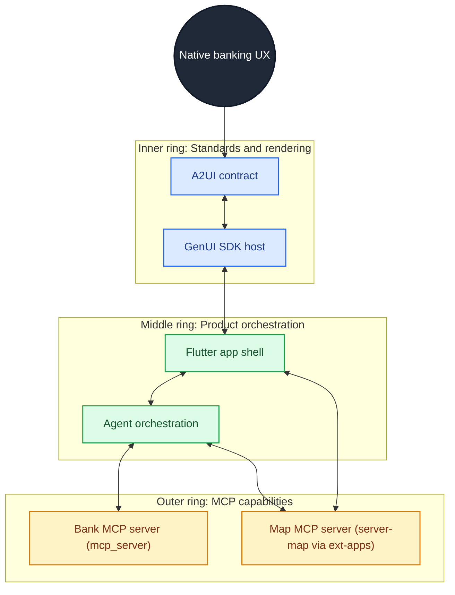
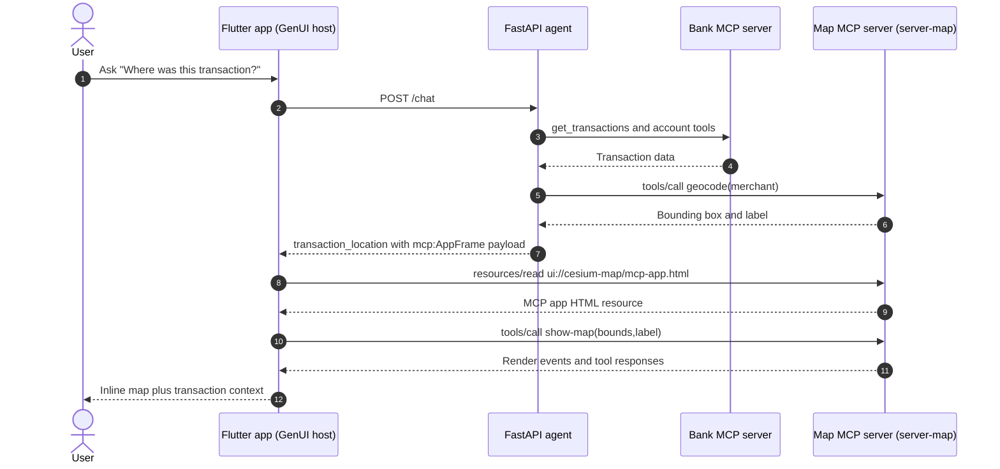

# AIBank

A demo AI-powered banking app. The backend agent serves banking data via a REST/A2A API; the Flutter app renders AI-generated UI using the GenUI/A2UI protocol.

## Architecture

The goal of this POC is to explore how a **native-feeling UI** can be built with Google's **A2UI** standard and **GenUI SDK**, while enabling **3rd-party extensibility** through the **MCP Apps extension**.
In this implementation, we use both the internal banking MCP server and an external map MCP app server.

### Relevant standards

- [MCP Apps extension (`modelcontextprotocol/ext-apps`)](https://github.com/modelcontextprotocol/ext-apps)
- [Google A2UI standard (`google/A2UI`)](https://github.com/google/A2UI)
- [A2UI Composer](https://a2ui-composer.ag-ui.com/)

### MCP servers used in this solution

| Server | Role in this POC | Transport |
|---|---|---|
| `mcp_server/` (bank tools) | Accounts, transactions, mortgage, credit-card data | In-process Python tool calls from `agent/runtime.py` |
| `@modelcontextprotocol/server-map` (from ext-apps) | Merchant geocode + hosted map app (`ui://cesium-map/mcp-app.html`) | MCP JSON-RPC over HTTP (`http://localhost:3001/mcp`) |

### 1) Conceptual (concentric) view



### 2) AIBank map flow (specific implementation)



### GenUI customizations required

- Added a custom `mcp:AppFrame` catalog item so A2UI can host MCP app UIs inside GenUI surfaces.
- Implemented platform-specific hosts:
  - **Web**: sandboxed iframe + `postMessage` relay to MCP JSON-RPC.
  - **Native**: WebView + JavaScript shim for `window.parent.postMessage`.
- Added MCP UI-host handling (`ui/initialize`, `ui/request-display-mode`, `tools/list`, `tools/call`) in the frame bridge.
- Patched the map app HTML before render to reduce minimum camera height for inline conversation use.
- Merged custom catalog items into the standard catalog with resilient component-name matching for namespaced items.

### Repository layout

```
mcp_server/   Internal banking MCP tools (accounts, transactions, mortgage, credit card)
agent/        FastAPI orchestration (bank MCP + map MCP calls, returns A2UI templates)
app/          Flutter host app with GenUI + mcp:AppFrame bridge
external      @modelcontextprotocol/server-map MCP server (started by dev.sh on :3001)
```

## Quick Start

### One-command dev startup

```bash
pip install -r agent/requirements.txt   # first time only
./dev.sh
```

This starts all four services and waits for Ctrl+C to shut them down:

| Service | URL | Notes |
|---|---|---|
| Agent | http://localhost:8080 | FastAPI with `--reload` |
| Map MCP server | http://localhost:3001/mcp | `@modelcontextprotocol/server-map` (MCP Apps ext) |
| MCP Inspector | http://localhost:5173 | Browser UI for exploring tools |
| Flutter web | http://localhost:3000 | Debug build, hot-reload via browser |

Logs are written to `.dev-logs/` (`agent.log`, `map-server.log`, `mcp.log`, `flutter.log`).

**Flags**

```bash
./dev.sh --no-mcp       # skip MCP inspector
./dev.sh --no-map-server  # skip external map MCP server
./dev.sh --no-flutter   # skip Flutter web (agent only)
```

**Prerequisites**

- Python 3.10+ with `pip install -r agent/requirements.txt`
- `pip install 'mcp[cli]'` for the MCP inspector (optional)
- Node.js + `npx` for `@modelcontextprotocol/server-map` (optional map flow)
- Flutter SDK with web support (`flutter config --enable-web`)

### Manual startup (if you prefer separate terminals)

#### 1. Start the agent backend

```bash
cd <repo root>
pip install -r agent/requirements.txt
python3 -m uvicorn agent.agent:app --host 0.0.0.0 --port 8080 --reload
```

Verify it is running:

```bash
curl http://127.0.0.1:8080/health
# {"status":"ok","model":"gpt-5-mini","runtime":"deterministic"}
```

#### 2. Start the MCP inspector (optional)

```bash
pip install 'mcp[cli]'
mcp dev mcp_server/mcp_server.py
# Opens Inspector UI at http://localhost:5173
```

#### 3. Start the external map MCP server (optional, required for map flow)

```bash
npx -y @modelcontextprotocol/server-map
# Exposes MCP HTTP endpoint at http://localhost:3001/mcp
```

In another terminal, set:

```bash
export MAP_SERVER_URL=http://localhost:3001/mcp
```

#### 4. Run the Flutter web app

```bash
cd app
flutter pub get
flutter run -d web-server --web-port 3000 --debug
```

#### 5. Run the Flutter Android app (emulator)

```bash
cd app
flutter pub get
flutter emulators --launch <emulator-id>  # if not already running
flutter run -d <emulator-id>
```

Tip: for Android-focused development, run backend services with `./dev.sh --no-flutter` and keep this Flutter terminal separate.

#### 6. Run the Flutter iOS app (simulator, macOS only)

```bash
cd app
flutter pub get
open -a Simulator
flutter run -d <ios-simulator-id>
```

Tip: ensure Xcode + iOS Simulator are installed, then use `flutter devices` to find the simulator device id.

The app connects to:
- **Android emulator** → `http://10.0.2.2:8080`
- **iOS simulator / desktop / web** → `http://127.0.0.1:8080`

The agent **must be running before you launch the app** or the first chat request will fail.

## Environment variables (agent)

Copy `agent/.env.example` to `agent/.env` and fill in values as needed.

| Variable | Default | Description |
|---|---|---|
| `AGENT_RUNTIME` | `deterministic` | Set to `adk` to use Google ADK + LLM |
| `LLM_MODEL` | `gpt-5-mini` | LLM model name (ADK runtime only) |
| `COPILOT_API_KEY` | — | API key for the LLM provider (ADK runtime) |
| `MAP_SERVER_URL` | — | MCP endpoint for `@modelcontextprotocol/server-map` (enables map MCP-app flow) |

The default `deterministic` runtime requires no API key and works offline.
If `MAP_SERVER_URL` is unset, map rendering falls back to text-only transaction responses.

## Running tests

```bash
# Python (agent + mcp_server)
python3 -m pytest

# Flutter
cd app && flutter test
```

## Components

- [agent/README.md](agent/README.md) — agent server details
- [mcp_server/README.md](mcp_server/README.md) — MCP banking tools details
- [app/README.md](app/README.md) — Flutter app details
